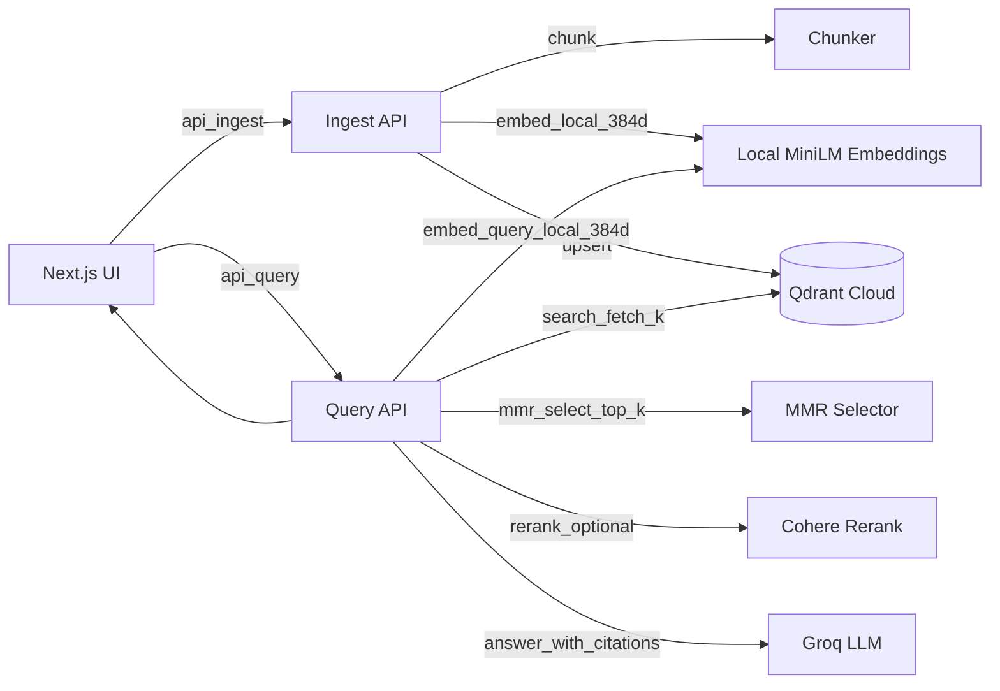

# Mini RAG (Retrieval-Augmented Generation)

A lightweight Retrieval-Augmented Generation (RAG) web application that allows users to ingest text documents, store embeddings in a hosted vector database, and ask grounded questions with cited answers.

Live demo and public repository are provided below.

---

## 🔗 Live Demo

**URL:** https://mini-rag-phi.vercel.app

---

## 📌 Overview

This application implements a small, production-minded RAG pipeline:

1. Users upload or paste text documents
2. The backend chunks and embeds the text
3. Embeddings are stored in a hosted vector database
4. User questions retrieve relevant chunks
5. Retrieved chunks are optionally re-ranked
6. A large language model generates a grounded answer with inline citations

The goal is to demonstrate a clear, end-to-end RAG system with clean architecture, hosted infrastructure, and explainable answers.

---

## 🧠 Architecture


## Architecture



---


---

## 🧱 Tech Stack

**Frontend**
- Next.js (App Router)
- React
- Deployed on Vercel

**Backend**
- Next.js API routes (Node.js runtime)

**Vector Database**
- Qdrant Cloud (hosted)

**Embeddings**
- Local MiniLM (`Xenova/all-MiniLM-L6-v2`, 384 dimensions)

**Reranking (Optional)**
- Cohere Rerank (`rerank-english-v3.0`)

**LLM**
- Groq (LLaMA-3.x models)

---

## ⚙️ How It Works

### Ingestion
- Text is chunked into ~1000 token segments with overlap
- Each chunk is embedded locally
- Vectors and metadata (doc ID, chunk index, text) are stored in Qdrant

### Querying
- The user query is embedded
- Top-K vectors are retrieved from Qdrant
- Maximal Marginal Relevance (MMR) is applied for diversity
- Chunks are optionally reranked
- The LLM generates a response using **only retrieved text**
- Inline citations (`[1]`, `[2]`) map answers to source chunks

### No-Answer Handling
If the retrieved context is insufficient, the system responds with:
> “I don’t know based on the provided document text.”

---

## 📊 Evaluation

A small gold-set evaluation was created using representative questions from ingested documents.

- **Gold Q/A pairs:** 5
- **Successful grounded answers:** 4
- **Success rate:** ~80%

Failures were mainly due to ambiguous questions or insufficient document context.

---

## 🧪 Running Locally

### Prerequisites
- Node.js ≥ 18
- Qdrant Cloud account
- Groq API key
- (Optional) Cohere API key

### Setup
```bash
npm install
